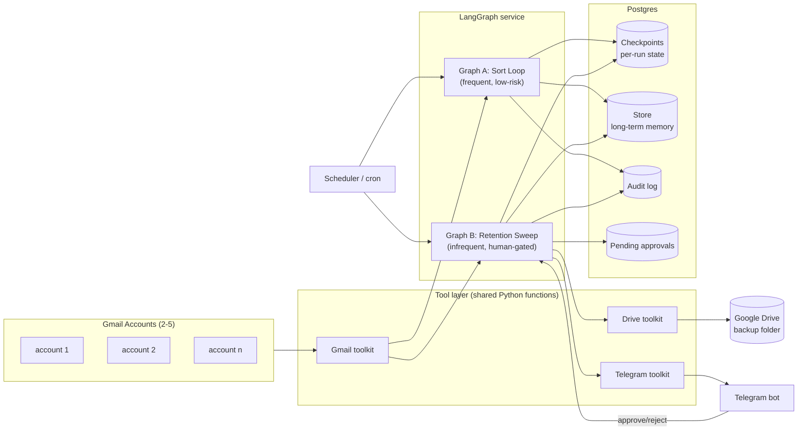
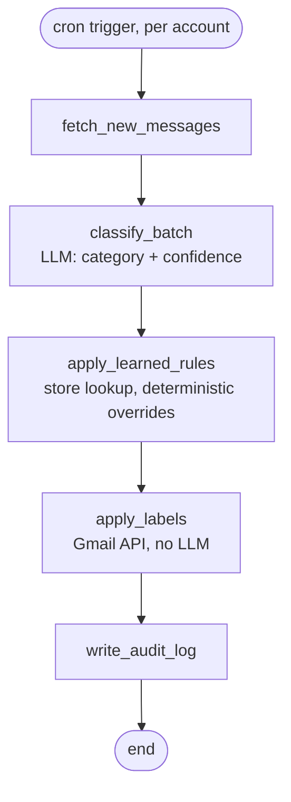
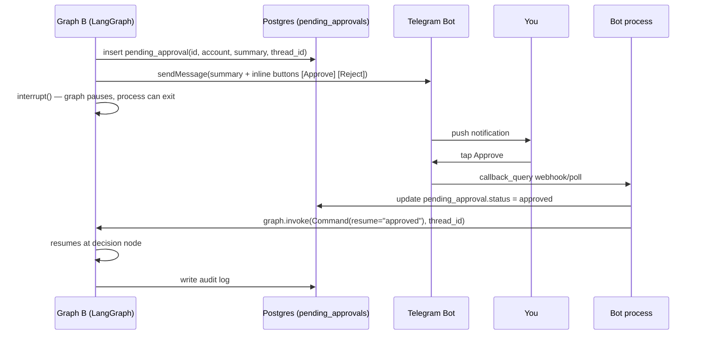
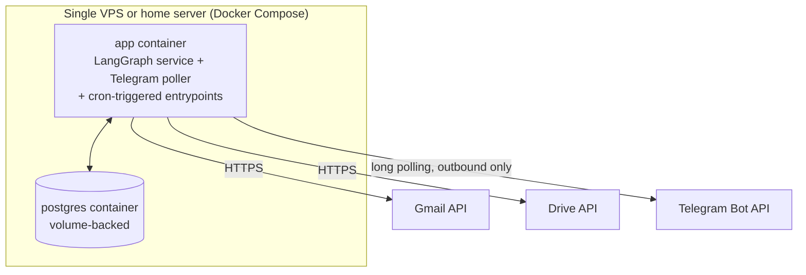

# Mailbox Sort & Cleanup Agent — Architecture & Build Plan

A production-grade, self-hosted LangGraph agent that sorts, labels, and retires old low-value mail
across multiple Gmail accounts, with Google Drive backup and Telegram-gated deletion approval.

This document is both a spec and a teaching reference: every major decision includes the *why*, so
it doubles as a walkthrough of how production agent systems are actually built (state, memory,
human-in-the-loop, tools, deployment) — not just a task list.

> **Implementation note — two deltas from the plan below, both deliberate:**
> 1. **LLM: Gemini 2.5 Flash Lite, not Claude.** Classification is high-volume, short-input,
>    fixed-label-set work — exactly what a "lite" tier model is priced for, and the cost win is
>    real at inbox scale. Everything else (LangGraph orchestration, the two-graph split, the
>    interrupt-based approval flow) is provider-agnostic and unchanged.
> 2. **SQLite, not Postgres, for both the checkpointer and the audit/rules tables.** At 2-5
>    accounts and no multi-worker concurrency, a database server buys nothing over a file — it's
>    still durable, still survives restarts, still lets the paused retention-sweep thread resume
>    correctly. Section 4's checkpointer/store *concepts* still apply; `sender_rules` is a plain
>    SQLite table standing in for LangGraph's `Store` abstraction. The Postgres path in section 10
>    is the documented next step if this ever needs multiple workers.
>
> **A third delta, added after the first working version**: the code moved from loose modules to
> an installable `src/mailbox_agent` package (`pyproject.toml`, `pip install -e .`), gained
> `tenacity` retry/backoff on external API calls, structured JSON logging, a `pytest` suite
> (`tests/unit/`), a classification-quality eval pipeline (`tests/eval/`, see EVALUATION.md), and
> ruff/mypy/pre-commit/CI config. None of that changes the architecture above — it's the gap
> between "a working script" and "something you'd hand to a teammate," which was the explicit
> point of building it this way: to have a real reference for what that gap looks like.
>
> **A fourth delta, from real-mailbox testing**: retention moved from one global age threshold
> applied to a fixed three-label list, to a **per-category policy**
> (`config.RETENTION_POLICY`, e.g. `promotions:0,social:0,newsletters:365,other:0`). Two categories
> were also added — `AI/Statements` (periodic bank/credit-card statements) and `AI/E-Mandate`
> (recurring auto-debits: EMIs, insurance premiums, subscription auto-renewals) — both excluded
> from retention by default (kept forever, like Important/Personal/Receipts). `other` (mail the
> classifier can't confidently place) is no longer a permanent bucket — it's in the default
> retention policy at 0 days, so it flows through the *same* Drive-backup + Telegram-approval path
> as Promotions/Social rather than silently accumulating forever. A category simply absent from the
> policy dict is what "never touched by retention" means now, replacing the old fixed
> important/receipts/personal exclusion list. Section 6's diagram and section 9's schema still
> describe the mechanism correctly; only the specific category list and day-counts changed.
> "0 days" means "eligible starting the next sweep run," not literally instantaneous — see
> `find_retention_candidates`'s docstring in `toolkit/gmail.py` for why (Gmail's `before:` search
> is date-granular).
>
> The actual code lives alongside this doc — see `README.md` for setup and
> `src/mailbox_agent/{toolkit,graphs,scripts,eval}/` for the implementation.

---

## 1. Requirements recap

**Functional**
- Connect to 2–5 personal Gmail accounts.
- Classify and label incoming/existing mail (Promotions, Social, Receipts, Newsletters, Personal,
  Important, etc.) — mirrors and extends Gmail's own categories with custom labels.
- Identify low-value mail (Promotions/Social/Newsletters) older than a configurable retention
  window (default 1 year).
- Before deleting: back up the raw messages to Google Drive.
- Never delete without a human approval step, delivered and confirmed via Telegram.
- Keep an audit trail of every automated action.

**Non-functional**
- Production-grade patterns: durable state, checkpointing, observability, human-in-the-loop,
  least-privilege auth — not a notebook script.
- Learning-oriented: uses LangGraph (the orchestration layer) and MCP (the tool-interop protocol)
  so the patterns transfer to other agent projects.
- Self-hosted, always-on, low cost (per your answers: Claude via Anthropic API, self-hosted Docker,
  2–5 accounts / low volume).

---

## 2. Prior art (what to actually read/borrow from)

Grounding this in what production teams already publish, rather than reinventing patterns:

- **[langchain-ai/agents-from-scratch](https://github.com/langchain-ai/agents-from-scratch)** —
  LangChain's own reference build of a Gmail assistant with human-in-the-loop and memory, built in
  LangGraph. This is the closest existing blueprint to what you're building; the graph shape and
  HITL interrupt pattern below are adapted from it.
- **[LangGraph persistence docs](https://docs.langchain.com/oss/python/langgraph/persistence)** —
  the canonical reference for checkpointer vs. store (short-term vs. long-term memory).
- **[Scaling LangGraph's Postgres Checkpointer in Production](https://tadeodonegana.com/posts/scaling-langgraph-postgres-checkpointer/)**
  — connection pooling and multi-worker checkpoint concerns at production scale.
- **[Human-in-the-Loop Workflows with LangGraph: Interrupts, Approvals, and Async Execution](https://www.abstractalgorithms.dev/langgraph-human-in-the-loop)**
  and **[LangGraph interrupt template (FastAPI + Next.js)](https://github.com/KirtiJha/langgraph-interrupt-workflow-template)**
  — the `interrupt()` / `Command(resume=...)` pattern used for the Telegram approval gate.
- Gmail MCP multi-account servers for reference/reuse of OAuth-per-account plumbing:
  **[gx-55/multi-gmail-mcp](https://github.com/gx-55/multi-gmail-mcp)**,
  **[dmorrill/gmail-mcp-multi](https://github.com/dmorrill/gmail-mcp-multi)**,
  **[Vinksj/claude-gmail-multi](https://github.com/Vinksj/claude-gmail-multi)**.
- **[gmail-ai-unsub](https://github.com/zbowling/gmail-ai-unsub)** — narrower scope (unsubscribe
  only) but a useful example of LLM-driven Gmail triage in production CLI form.

You already have interactive Gmail + Drive MCP connectors available right in this chat
(`mcp__claude_ai_Gmail__*`, `mcp__claude_ai_Google_Drive__*`). Those are **single-account,
human-driven** tools meant for a person typing requests to Claude — great for prototyping
classification prompts and previewing what a Drive backup should look like *right now, in this
conversation*, but not the multi-account, unattended, scheduled service the production system
needs. Phase 0 below uses them explicitly for that purpose.

---

## 3. High-level architecture



Two graphs, not one — this is the central design decision, and it's the same split most
production agents converge on: **separate the frequent, reversible, low-risk automation from the
rare, irreversible, high-risk one**, and only gate the second with a human.

- **Graph A — Sort Loop**: runs every 15–30 min per account. Fetches new mail, classifies it,
  applies labels. Fully autonomous, no destructive actions, safe to run unattended.
- **Graph B — Retention Sweep**: runs weekly. Finds label+age-eligible mail, backs it up to Drive,
  pauses for Telegram approval, deletes (to Trash, never permanent) only on explicit approval.

---

## 4. State & memory design

LangGraph distinguishes two kinds of persistence — use both, they solve different problems:

| | Checkpointer | Store |
|---|---|---|
| Scope | one run (`thread_id`) | across all runs |
| Holds | in-flight graph state, resumable after interrupt/crash | durable knowledge that should persist and inform future runs |
| Backend | `PostgresSaver` | `PostgresStore` |
| Example here | "this sweep found 214 emails, backup done, waiting on Telegram approval id 8831" | "user always wants receipts from `stripe.com` kept forever"; "user rejected deletion of `newsletter@x.com` last month, don't re-suggest for 90 days" |

**Checkpointer** — every run gets `thread_id = f"{account_id}:{graph_name}:{run_date}"`. This is
what makes the Telegram interrupt safe: the graph pauses mid-execution, the process can restart,
and `Command(resume=...)` picks the exact node back up days later if needed.

**Store (long-term memory / the "learning" part)** — this is what turns a static rule engine into
something that improves:
- `sender_rules`: learned mappings built from corrections (`noreply@shop.com → always Promotions,
  safe to auto-delete after 1yr`).
- `user_preferences`: retention windows per label, VIP sender allowlist that's never touched,
  per-account overrides.
- Every time you reject or edit a suggested action via Telegram, that correction is written back
  to the store and retrieved (as few-shot context) the next time a similar sender/subject pattern
  appears. This is a lightweight retrieval-augmented correction loop, not a fine-tune — simple, and
  the standard production pattern for "agent that gets better with your feedback."

**Don't put large payloads in graph state.** The checkpointer snapshots state at every node — an
email body or attachment sitting in state gets rewritten to Postgres on every step. Keep state to
IDs, summaries, and classification metadata; fetch full message bodies from Gmail on demand inside
the node that needs them.

```python
class SortState(TypedDict):
    account_id: str
    since: datetime
    messages: list[EmailSummary]        # id, sender, subject, snippet, date — not full body
    classifications: dict[str, Classification]
    labeled: list[str]

class SweepState(TypedDict):
    account_id: str
    candidates: list[EmailSummary]       # Promotions/Social, age > retention window
    backup_manifest: BackupManifest | None
    approval_request_id: str | None
    approval_status: Literal["pending", "approved", "rejected", "expired"] | None
    deleted: list[str]
```

---

## 5. Graph A — Sort Loop (detail)



- `classify_batch` sends the LLM a batch of `(sender, subject, snippet)` — never full bodies unless
  a message is ambiguous — to keep token cost and latency down. Output: category + confidence +
  suggested label, structured via tool-call / JSON schema, not free text.
- `apply_learned_rules` runs **before** trusting the LLM output: known senders resolve
  deterministically from the store, skipping the model entirely for repeat senders (cheaper, more
  consistent, and the natural place corrections take effect).
- Nothing in this graph deletes or archives anything — it only labels. That's what makes it safe to
  run unattended every 15–30 minutes with no human in the loop.

---

## 6. Graph B — Retention Sweep (detail)

```mermaid
flowchart TD
    start([weekly cron, per account]) --> find[find_retention_candidates\nlabel in Promotions/Social/Newsletters\nAND age > 1yr AND not starred/VIP]
    find --> gate{any candidates?}
    gate -->|no| done1([end])
    gate -->|yes| backup[backup_to_drive\nexport as .eml, zip per sweep,\nupload to Backups/<account>/<year>]
    backup --> summarize[build_approval_summary\ncount, senders, size, date range]
    summarize --> notify[telegram_notify_and_wait\ninterrupt()]
    notify --> decision{Telegram response}
    decision -->|approved| trash[trash_messages\nGmail trash, NOT permanent delete]
    decision -->|rejected| skip[mark_reviewed_skip]
    decision -->|no response in 48h| expire[mark_expired\nauto-retry next sweep]
    trash --> audit[write_audit_log]
    skip --> audit
    expire --> audit
    audit --> done2([end])
```

Key safety decisions, each deliberate:

- **Trash, not permanent delete.** Gmail's `messages.trash` moves mail to Trash, which
  auto-purges after 30 days. Even after backup + human approval, this gives a 30-day recovery
  window for free — defense in depth against a bad approval or a bug in the sweep logic.
- **VIP/starred/important mail is excluded before the LLM ever sees it** — a deterministic filter,
  not a model judgment call, for the one rule that must never be wrong.
- **Backup happens before the approval ask**, not after — so the Telegram message can say "backed
  up, ready to delete" rather than promising a backup that hasn't happened yet, and a rejected
  approval still leaves a safe backup sitting in Drive at no cost.
- **48h TTL on pending approvals.** Production human-in-the-loop systems need an expiry job —
  otherwise a missed Telegram notification leaves a graph paused forever. On expiry, nothing is
  deleted; it just re-queues for the next sweep.

---

## 7. Telegram approval — sequence



**Polling vs. webhook**: for a self-hosted, always-on setup, use **long polling**
(`getUpdates`) rather than a Telegram webhook. A webhook requires a public HTTPS endpoint (extra
attack surface, need for TLS/tunnel); long polling needs no inbound port at all — the bot process
just asks Telegram for updates. For a home server or a small VPS this is the simpler and more
secure default; only switch to webhooks if you outgrow single-process polling.

---

## 8. Tools: build once, expose two ways

You asked specifically about MCP. Here's the honest tradeoff:

- For the **unattended scheduled pipeline**, MCP is unnecessary overhead — an extra process hop
  for calls that only your own LangGraph nodes make. Plain Python functions calling the Gmail/Drive
  API client libraries directly are simpler and have one less thing to fail at 3am.
- MCP earns its place as a **second, optional surface**: wrap the same underlying functions
  (`list_low_value_candidates`, `trash_messages`, `backup_to_drive`, …) as an MCP server, and you
  get a manual override console for free — inspect what the agent is about to do, or hand-run a
  sweep, from Claude Desktop/Code, using the *exact same, already-tested* toolkit code the
  autonomous graph uses.

This "one toolkit, two front doors" pattern (direct function calls for the automated path, MCP
wrapper for the human-driven path) is a common real pattern for exactly this reason: you don't
want your interactive tools and your automated tools to drift into two different implementations
of "what does deleting an email actually do."

```
src/mailbox_agent/
  toolkit/
    gmail.py      # list_messages, get_message, apply_label, trash_messages, create_label
    drive.py      # backup_messages_to_drive
    telegram.py   # send_approval_request, poll_updates
    rules.py      # store-backed learned sender rules
    retry.py      # tenacity retry policies - see section 12a

  graphs/
    sort_loop.py       # imports toolkit/*.py directly
    retention_sweep.py # imports toolkit/*.py directly

  mcp_server/
    server.py     # thin MCP wrapper around toolkit/*.py, for Claude Desktop/Code use only
```

---

## 9. Storage schema (Postgres — future scale path)

Besides LangGraph's own `checkpoints` and `store` tables, a handful of app tables. Shown here in
Postgres syntax as the eventual multi-worker path; the shipped implementation is the same shape as
plain SQLite — see `db/schema.sql` for the actual, current schema.

```sql
accounts (
  id text primary key,          -- e.g. "personal", "work"
  email text not null,
  oauth_token_encrypted bytea,
  created_at timestamptz
);

audit_log (
  id bigserial primary key,
  account_id text references accounts(id),
  run_id text,                  -- thread_id
  action text,                  -- 'label' | 'backup' | 'trash' | 'skip'
  message_ids text[],
  detail jsonb,
  created_at timestamptz default now()
);

pending_approvals (
  id uuid primary key,
  account_id text references accounts(id),
  thread_id text,
  summary jsonb,
  status text default 'pending',  -- pending | approved | rejected | expired
  created_at timestamptz default now(),
  resolved_at timestamptz
);
```

`audit_log` is what makes this trustworthy: every label, backup, and trash action is attributable
and reviewable after the fact — the same reason production systems log every side-effecting tool
call, not just the ones that go wrong.

---

## 10. Tech stack

| Layer | Choice | Why |
|---|---|---|
| LLM | Gemini 2.5 Flash Lite (`langchain-google-genai`) | High-volume, low-complexity, fixed-label classification is exactly what a lite-tier model is priced for; big cost win at inbox scale |
| Orchestration | LangGraph (Python) | Graph-native control flow, native `interrupt()`/`Command(resume=…)` for HITL, checkpointing built in |
| Gmail/Drive access | `google-api-python-client` inside toolkit functions | Direct, no extra hop; wrapped as MCP separately for manual use |
| Approval channel | plain HTTP calls to the Telegram Bot API, long polling | No inbound port needed for a home/VPS deployment; no extra bot-framework dependency |
| State/memory | SQLite (`SqliteSaver` for checkpoints, plain tables for audit/rules) | Durable and resumable at 2-5 accounts with no multi-worker concurrency; a DB server buys nothing here — see the implementation note above and the Postgres path below if that changes |
| Scheduler | APScheduler in-process (inside `app.py`) | One process to run (`python app.py`), no separate cron entries to manage |
| Observability | structured logs + `audit_log` table | Every label/backup/trash action is attributable after the fact; add LangSmith later if deeper trace visibility into classification decisions is needed |
| Deployment | single `python app.py` process locally/on a spare always-on machine today; Docker Compose (`app` + optional Postgres) is the documented next step | Matches "self-hosted, always-on" without requiring infra before the core loop is proven |
| Secrets | `.env`, OAuth tokens as local per-account JSON files under `secrets/` | Never in git (`.gitignore`'d); encrypt-at-rest is a hardening step for the eventual VPS deploy |

---

## 11. Deployment



- Single Docker Compose stack: `app` (Python, runs `sort_loop` and `retention_sweep` as scheduled
  entrypoints, plus a small always-running Telegram polling loop) + `postgres` (own volume).
- No inbound ports required at all — Gmail/Drive/Telegram are all outbound HTTPS calls. This is a
  meaningfully smaller attack surface than a typical "deploy a web service" setup, worth calling
  out as a deliberate advantage of the polling-based design.
- Back up the Postgres volume itself (it now holds OAuth tokens and audit history) — a nightly
  `pg_dump` to the same Drive backup folder is enough at this scale.
- Cost: a $5-6/mo VPS (Hetzner/Fly.io small instance) or a spare always-on machine you already
  have; Claude API cost at this volume (a few thousand emails/month, batched classification) should
  be single-digit dollars/month with prompt caching.

---

## 12. Safety defaults (non-negotiable, set these before anything else)

1. **Global dry-run flag**, on by default. In dry-run, Graph B computes candidates and would-be
   actions and posts them to Telegram as a report, but takes no Gmail/Drive action.
2. **Trash, never `messages.delete`.** 30-day Gmail recovery window as a backstop even after
   approval.
3. **VIP/starred/important-labeled mail is excluded before classification**, deterministically.
4. **Every destructive action requires a resolved `pending_approvals` row** — no code path deletes
   without one.
5. **Least-privilege OAuth scopes** — request `gmail.modify` (labels + trash) rather than full
   `mail.google.com`; `drive.file` (app-created files only) rather than full Drive access.

---

## 12a. Retry semantics — not every call should retry the same way

A production system fails constantly at the edges (rate limits, transient 5xxs, dropped
connections) — the question is never "should we retry," it's "which calls are actually safe to
retry blindly." `toolkit/retry.py` draws that line explicitly rather than wrapping everything in
one generic retry decorator:

- **Reads** (`retry_read`, 5 attempts): always safe — re-fetching data has no side effects.
- **Idempotent writes** (`retry_idempotent_write`, 3 attempts): safe *because* the operation is a
  no-op if repeated — adding a label a message already has, trashing an already-trashed message,
  a 409-on-retry falling back to a lookup for label creation.
- **Left un-retried, deliberately**: the Drive backup upload (`drive.py`) and folder creation. An
  upload is not idempotent — retrying after a lost response (not a lost write) could duplicate the
  backup file, and Drive doesn't enforce unique folder names, so a duplicate wouldn't even error.
  Failing loudly here — before any approval request goes out and before Gmail is touched — is the
  safer failure mode than silently duplicating a backup.

This is the actual skill "add retries" is testing for: not knowing tenacity's API, but knowing
which operations tolerate being repeated.

## 12b. Testing & evaluation

Two different kinds of correctness need two different kinds of check, and neither substitutes for
the other:

- **`tests/unit/`** (`pytest`, no network, no real credentials) — verifies the *code* is wired
  correctly: the sort loop actually labels and learns, the retention sweep actually pauses at
  approval and doesn't double-fire side effects on resume (the LangGraph re-run-on-resume gotcha
  from section 6 is exactly the kind of bug that silently ships without a test for it), a rejected
  approval trashes nothing. Runs in `make check` and on every CI push.
- **`tests/eval/`** (`pytest -m eval`, real Gemini calls, real cost) — verifies the *model* is
  actually good at the job: does sender/subject/snippet get mapped to the right category. A unit
  test can assert the LLM was called; only an eval can assert its answer was right. See
  **EVALUATION.md** for the full methodology (why exact-match accuracy rather than LLM-as-judge,
  why it's a manual/`workflow_dispatch` CI job rather than a blocking check on every commit, and
  how to grow the bundled synthetic golden set into one based on your real mailbox).

---

## 13. Phased build plan

| Phase | Deliverable | Notes |
|---|---|---|
| **0 — Prototype now** | Use the Gmail/Drive MCP connectors already available in this chat to hand-test classification prompts on real mail and preview a Drive backup file, no code | Fast feedback on prompt quality before writing infra |
| **1 — MVP** | Single account, Graph A only (fetch → classify → label), run manually from CLI, checkpointer | Prove the classification quality and labeling loop |
| **2 — Multi-account** | Loop over 2-5 accounts, per-account OAuth token storage, cron scheduling | |
| **3 — Retention + approval** | Graph B: candidate detection → Drive backup → Telegram approval → trash, dry-run on by default | The highest-risk phase; keep dry-run on until you trust it |
| **4 — Memory & learning loop** | Store-backed `sender_rules`, corrections from Telegram rejections feed back into future classification | |
| **5a — Harden (done)** | Installable package, retry/backoff, structured logging, unit test suite, classification eval pipeline, ruff/mypy/pre-commit/CI | See sections 12a/12b above and EVALUATION.md |
| **5b — Deploy (not yet built)** | Dockerize, deploy to VPS, LangSmith tracing, Postgres if multi-worker is ever needed | See section 11's Docker Compose sketch |

---

## 14. What to do right now, in this chat

Since Gmail and Drive MCP connectors are already live in this session, the fastest first step
costs nothing to build: pick ~20 real emails from your inbox, ask me to classify them via
`mcp__claude_ai_Gmail__search_threads` + `get_message`, and we tune the classification categories
and prompt against your actual mailbox before any of Phase 1 gets written. Want to start there?
